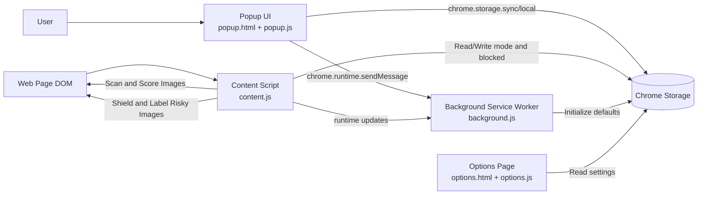
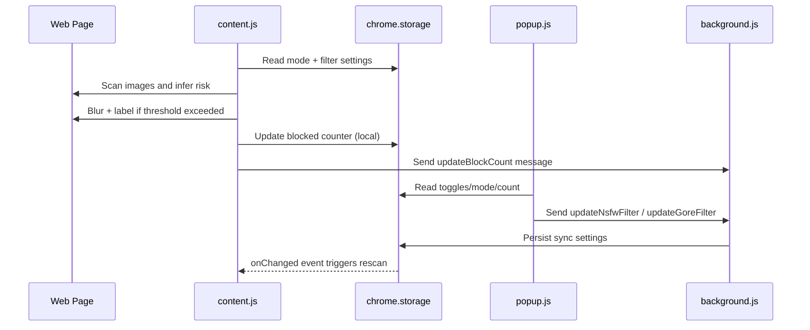

# SafeNet AI Architecture

## Purpose

SafeNet AI is a Chrome Extension (Manifest V3) that protects users from sensitive visual content by scanning webpage images and applying a blur shield based on a risk score.

## High-Level Goals

- Detect potentially unsafe image content in page context.
- Apply protective shielding with user-controlled filtering modes.
- Persist preferences and counters across browsing sessions.
- Keep the architecture ready for future AI model and API integration.

## System Components

### 1) Manifest and Runtime Wiring

- File: `manifest.json`
- Declares extension entry points and permissions.
- Registers:
  - Service worker: `background.js`
  - Content script: `content.js` at `document_start`
  - Popup UI: `popup.html` + `popup.js`
  - Options page: `options.html` + `options.js`

### 2) Content Processing Layer

- File: `content.js`
- Responsibilities:
  - Discover images in the DOM.
  - Infer risk from placeholder keyword-based scoring logic.
  - Apply blur and blocked labels for risky items.
  - Re-scan dynamic page updates via `MutationObserver`.

### 3) Background Coordination Layer

- File: `background.js`
- Responsibilities:
  - Initialize default settings at install time.
  - Handle runtime messages from popup/content scripts.
  - Persist and update synchronized settings.

### 4) User Control Layer (Popup)

- Files: `popup.html`, `popup.js`, `style.css`
- Responsibilities:
  - Toggle NSFW and gore filtering.
  - Change filtering mode (`strict`, `balanced`, `off`).
  - Show and reset blocked counter.

### 5) Configuration Layer (Options)

- Files: `options.html`, `options.js`
- Responsibilities:
  - Show current filter status.
  - Host future advanced policy controls.

## Data and State Design

### Storage Keys

- `chrome.storage.sync`
  - `nsfw-enabled` (boolean)
  - `gore-enabled` (boolean)
  - `blocked-count` (number, background-owned)
- `chrome.storage.local`
  - `mode` (`strict` | `balanced` | `off`)
  - `blocked` (number, content/popup-owned)

### Message Types

- `updateNsfwFilter`
- `updateGoreFilter`
- `resetBlockCount`
- `incrementBlockCount`
- `updateBlockCount`

## Runtime Flow (Current)

1. Browser loads extension and executes install defaults (if first run).
2. Content script starts at `document_start` and initializes mode/settings.
3. Script scans unprocessed images and computes placeholder risk values.
4. Risky images are blurred, labeled, and counted.
5. Popup reflects state and allows user updates to toggles/mode.
6. Storage and runtime messages propagate updates across contexts.

## Mermaid Diagrams

### Component Architecture

### Runtime Sequence (Simplified)

## Known Constraints

- Placeholder model scoring is keyword-based and not true image AI.
- Counter ownership is currently split between local and sync storage keys.
- Trusted sites list is static and hardcoded.

## Extension Points

- Replace placeholder model in `content.js` with real classifier integration.
- Move to single-source blocked counter ownership.
- Add policy engine for per-domain allowlist and temporary bypass.
- Introduce confidence thresholds as configurable settings.
